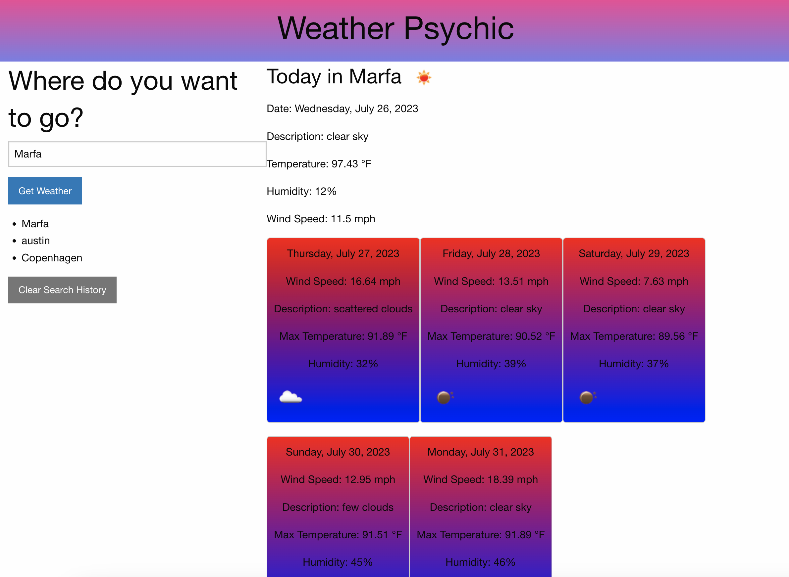

# Weather Psychic

## Description
An application that displays current and future weather conditions of a city chosen by the user.

Check out my weather application [here!](https://k8sterchi.github.io/weather-psychic/)

## User Story
As a traveler, I want to see the weather outlook for multiple cities SO THAT I can plan a trip accordingly.

## Acceptance Criteria
Given dashboard with form inputs:

WHEN I search for a city, 

THEN I am presented with current and future conditions for that city and that city is added to local storage. 

WHEN I view current conditions for that city, 

THEN I am presented with the city name, the date, an icon representation of the weather, the temperature, the humidity, and the wind speed. 

WHEN I view future conditions for that city,

THEN I am presented with a 5-day forecast with date, weather icon, temperature, wind speed, and humidity.

WHEN I click on a city in the search history,

THEN I am presented with current and future conditions for that city. 

## Resources:

- I used the [openWeather](https://openweathermap.org/) API to retrieve weather data.

- Geocoding: for how to retrieve geographical coordinates using a given city's name, [click here.](https://openweathermap.org/api/geocoding-api)

- Tutoring / pair programming with Dane Shrewsbury, incredibly helpful. 

- [ChatGPT](https://openai.com/chatgpt) continues to help me write succinct and dynamic code. 

- I continue to refer to [markdown best practices](https://www.markdownguide.org/basic-syntax) in order to develop best practices.

- [This full-stack blog](https://coding-boot-camp.github.io/full-stack/apis/how-to-use-api-keys) on how to use API keys was informative.

- It is your responsibility to include a note in the README section of your repo specifying code source and its location within your repo.
